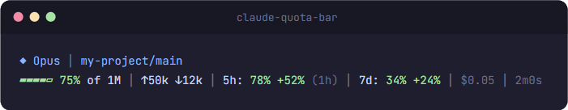
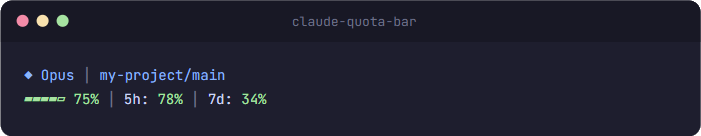

# claude-usage-monitor

[](https://github.com/aiedwardyi/claude-usage-monitor/actions/workflows/smoke-tests.yml)
[](LICENSE)

Claude Code statusline plugin that shows 5-hour quota, 7-day quota, context usage, tokens, and reset countdowns directly in the terminal.

No extra API key. No extra Python packages. Uses your existing Claude Code OAuth session.
Windows launches Python directly, so there is no Git Bash requirement.


## Quickstart

### Windows PowerShell

```powershell
irm https://raw.githubusercontent.com/aiedwardyi/claude-usage-monitor/main/install.ps1 | iex
```

### macOS / Linux

```bash
curl -fsSL https://raw.githubusercontent.com/aiedwardyi/claude-usage-monitor/main/install.sh | bash
```

### Prefer to audit first

```bash
git clone https://github.com/aiedwardyi/claude-usage-monitor.git
cd claude-usage-monitor
python install.py
```

On Windows, `py -3 install.py` works too.

The installer:

- copies the launcher files into `~/.claude/plugins/claude-usage-monitor`
- updates `~/.claude/settings.json`
- creates `settings.json.bak` before replacing an existing settings file
- runs a launcher smoke check and prints the exact verify command

### Fast first success

If the installer succeeds, restart Claude Code and you should see a statusline like this:

```text
◆ Opus │ my-project/main
▰▰▰▰▱ 75% │ ↑50k ↓12k │ 5h: 20% (1h) │ 7d: 66% │ 2m0s
```

If you want to verify the launcher yourself before restarting Claude Code:

- Windows: `type nul | "C:\Users\you\.claude\plugins\claude-usage-monitor\statusline.cmd"`
- macOS / Linux: `printf '' | bash ~/.claude/plugins/claude-usage-monitor/statusline.sh`

Expected output:

```text
Claude
```

## Why people install it

It adds the quota information that matters while you are already coding:

- 5-hour quota used percentage and reset countdown
- 7-day quota used percentage
- context remaining as a compact gauge
- input and output tokens for the current session
- model, project, branch, and session duration

## What it shows

```text
◆ Opus │ my-project/main
▰▰▰▰▱ 75% │ ↑50k ↓12k │ 5h: 20% (1h) │ 7d: 66% │ 2m0s
```

| Segment | Description |
|---|---|
| `◆ Opus` | Active model |
| `my-project/main` | Project name and git branch |
| `▰▰▰▰▱ 75%` | Context window remaining |
| `↑50k ↓12k` | Input and output tokens for this session |
| `5h: 20%` | 5-hour quota used percentage |
| `(1h)` | Time until the 5-hour window resets |
| `7d: 66%` | 7-day quota used percentage |
| `2m0s` | Session duration |

### Color coding

| Color | Meaning |
|---|---|
| Green | under 70% used |
| Yellow | 70% to 90% used |
| Red | over 90% used |

## Trust and security

This is the part most people should inspect before installing.

At runtime, the tool:

- reads Claude Code session JSON from `stdin`
- reads `~/.claude/.credentials.json` only to access `claudeAiOauth.accessToken`, unless `CLAUDE_CODE_OAUTH_TOKEN` is already set
- runs `git rev-parse --abbrev-ref HEAD` in your project directory to show the branch
- writes `claude-sl-usage.json` and `claude-sl-usage.lock` in your system temp directory
- makes one HTTPS request to `https://api.anthropic.com/api/oauth/usage`

It does not:

- install dependencies
- collect analytics or telemetry
- send repository contents, prompts, or local files anywhere other than Anthropic's usage endpoint

The installer writes only these locations:

- `~/.claude/plugins/claude-usage-monitor/`
- `~/.claude/settings.json`
- `~/.claude/settings.json.bak`

More detail is in [SECURITY.md](SECURITY.md).

## Requirements

- [Claude Code CLI](https://docs.anthropic.com/en/docs/claude-code) with an active subscription
- Python 3.10+ available as `python3`, `python`, or `py -3`
- macOS / Linux: `bash`
- Windows: no Git Bash requirement

## How it works

1. Claude Code pipes session JSON into the launcher on every refresh.
2. `statusline.py` parses that payload and reads your Claude Code OAuth token.
3. It calls Anthropic's usage endpoint to fetch current 5-hour and 7-day utilization.
4. The result is cached in your system temp directory for 5 minutes.
5. The script prints a two-line ANSI statusline.

The first render may show `5h: --` and `7d: --` until the background fetch finishes and the next refresh uses the cached result.

## Compatibility

| Platform | Launcher | Status |
|---|---|---|
| Windows 11 | `statusline.cmd` | Tested |
| macOS | `statusline.sh` | Tested in CI |
| Linux | `statusline.sh` | Tested in CI |

Windows now launches Python directly. It does not depend on Git Bash.

## Customization

Every segment is toggleable via environment variables. Set them in your shell profile, or add them to the `env` block in `~/.claude/settings.json`:

```json
{
  "env": {
    "CQB_PACE": "1",
    "CQB_CONTEXT_SIZE": "1",
    "CQB_COST": "1"
  }
}
```

| Variable | Default | Description |
|---|---|---|
| `CQB_TOKENS` | `1` | Show token counts |
| `CQB_RESET` | `1` | Show reset countdowns |
| `CQB_DURATION` | `1` | Show session duration |
| `CQB_BRANCH` | `1` | Show git branch |
| `CQB_CONTEXT_SIZE` | `0` | Show context size label such as `of 1M` |
| `CQB_PACE` | `0` | Show pacing indicator |
| `CQB_COST` | `0` | Show session cost |

### Presets

**Maximal**



```json
{ "env": { "CQB_PACE": "1", "CQB_CONTEXT_SIZE": "1", "CQB_COST": "1" } }
```

**Minimal**



```json
{ "env": { "CQB_TOKENS": "0", "CQB_RESET": "0", "CQB_DURATION": "0" } }
```

**Heavy context**


**Critical usage**


## Manual install

If you do not want to use the one-command installers:

```bash
git clone https://github.com/aiedwardyi/claude-usage-monitor.git
cd claude-usage-monitor
python install.py
```

On Windows, `py -3 install.py` works too.

Or update `~/.claude/settings.json` yourself:

```json
{
  "statusLine": {
    "type": "command",
    "command": "bash /path/to/statusline.sh",
    "padding": 0
  }
}
```

On Windows, use the absolute path to `statusline.cmd` instead of the Unix launcher command.

## Troubleshooting

**The launcher check fails**

- Make sure `python3`, `python`, or `py -3` works from your shell.
- On macOS and Linux, make sure `bash` is installed.

**The statusline shows `5h: -- | 7d: --`**

- The first API call runs in the background.
- Wait a few seconds for the cache to populate and let Claude Code refresh once more.

**Unicode characters look wrong**

- Use a UTF-8 terminal font and encoding.
- On older Windows terminals, run `chcp 65001`.

**I want to inspect the network behavior**

- Read [statusline.py](statusline.py) and [SECURITY.md](SECURITY.md).
- The only runtime network call is `https://api.anthropic.com/api/oauth/usage`.

## Contributing

Issues and pull requests are welcome. Start with [CONTRIBUTING.md](CONTRIBUTING.md).

## License

MIT
